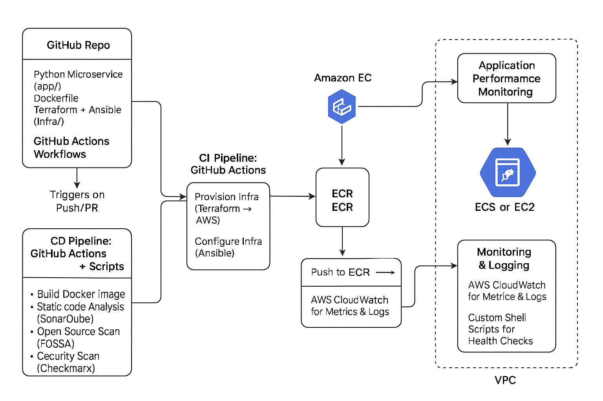

# 🚀 End-to-End Automated CI/CD Pipeline for a Python Microservice

A production-grade, full-lifecycle DevOps project that demonstrates infrastructure provisioning, containerization, CI/CD, code quality analysis, and monitoring — all automated and built using modern DevOps tools on AWS.
 
---

## 📌 Objective

To automate the entire lifecycle of a Python microservice deployment — from writing code to deploying on AWS with proper quality and security gates, monitoring, and alerts in place. This project simulates a real-world SaaS delivery platform.

---

## 🏗️ Architecture Overview



---

## 🧰 Tech Stack

| Layer               | Tools Used                                           |
|---------------------|------------------------------------------------------|
| **Source Control**   | GitHub + GitHub Copilot                             |
| **CI/CD**            | GitHub Actions + Shell Scripts                      |
| **Infrastructure**   | Terraform (VPC, EC2, IAM, ECR)                      |
| **Configuration**    | Ansible (Docker installation, app setup)            |
| **Application**      | Python REST API (Flask/FastAPI)                     |
| **Containerization** | Docker + AWS ECR                                    |
| **Deployment**       | EC2 (cost-effective, or ECS for scalable option)    |
| **Code Quality**     | SonarQube + FOSSA + Checkmarx                       |
| **Monitoring**       | AWS CloudWatch + APM + Custom Shell-based checks    |

---

## 🔄 Flow of Execution

1. **Code is pushed to GitHub**  
   GitHub Actions triggers both CI and CD workflows.

2. **CI Workflow:**
   - Lint & unit test Python app
   - Build Docker image and push to **ECR**
   - Run **SonarQube** for code quality
   - Run **FOSSA** for license check
   - Run **Checkmarx** for security scan

3. **CD Workflow:**
   - Provision AWS resources (VPC, EC2, ECR, Security Groups) using **Terraform**
   - Configure EC2 instance with **Ansible** (Docker, app deps)
   - Pull Docker image from ECR and run container on EC2
   - Setup AWS CloudWatch logs & APM integration

4. **Monitoring:**
   - App logs/metrics sent to **CloudWatch**
   - Uptime/health monitored with `health_check.sh`
   - Shell script sends alerts/Slack notification if service fails

---

## 📝 How to Use

### 1. Clone the Repo
```bash
git clone https://github.com/your-username/devops-python-cicd-pipeline.git
cd devops-python-cicd-pipeline
```

### 2. Setup AWS Credentials
```bash
aws configure
```

### 3. Provision Infra
```bash
cd infra/terraform
terraform init
terraform apply
```

### 4. Configure EC2
```bash
cd ../ansible
ansible-playbook playbook.yml -i inventory
```

### 5. Trigger CI/CD
```bash
Push changes to main branch and GitHub Actions will do the magic 🎩
```
---

## 📊 Monitoring & Alerts

Logs: View in CloudWatch Log Groups

Health: Run scripts/health_check.sh

Optional: Add Slack/MS Teams alert via webhook in notify.sh

---

## ✍️ Blog Post
Coming soon: “Building an End-to-End DevOps Pipeline with GitHub Actions & AWS”
Stay tuned!

---

## 🤝 Author
Kshitij Tripathi – DevOps Engineer | GCP ACE | GCP PCA | AZ-900 | Cloud Ninja 🧠
LinkedIn

---

Would you like this README also as a **PDF** to share in your portfolio/blog or shall I push it into your GitHub repo structure mockup?


